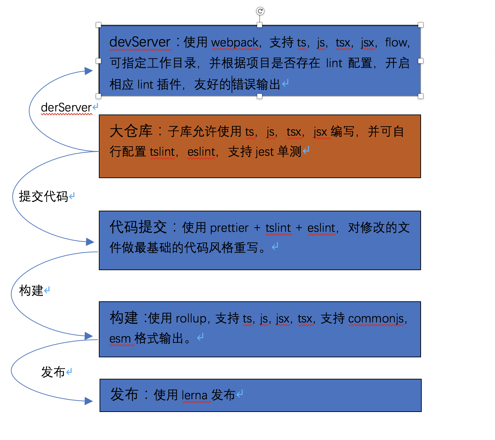

### XMIOT架构图

#### server 运行

根目录下运行

```
npm run server 入口文件（相对于更目录）
```

#### 注意事项

##### 1. 目前的构建不算不友好，回将runtime打包进去（使用了react-app去处理），后期会脱离react-app独立去配置

##### 2. 每个库的配置都要写好external

##### 3. 每个库可以在styleOptions中针对样式打包进行处理，详细api查看 utils/plugins/rollup-plugin-style

##### 4. 每个库可以在copyOptions中对文件复制到输出目录的某个地方


  
